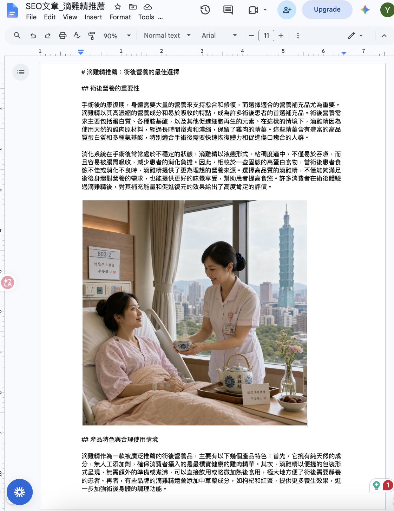

# n8n SEO 內容生成工具｜SEO Content Pipeline (n8n self-host based)

[English version](#english)

## 中文說明

這是一個以 **n8n、Google Sheets、Google Drive 與 Google Docs** 建立的 SEO 內容生成工具。使用者在 Google Sheet 輸入關鍵字、推廣產品與使用情境後，透過按鈕觸發工作流，產生文章、三張配圖與 Google Docs 成果。

- 可操作範例（唯讀輸入／輸出控制面板）：[開啟 Google Sheet](https://docs.google.com/spreadsheets/d/1FnD3XRmuw_B23JNAbtWJXOz67vuobMS0H9Mzp_wMmHo/edit?usp=sharing)

## 作品集專案

此專案將 Google Sheet 中的一列內容需求，轉換為一篇具結構的繁體中文 SEO 文章、三張情境圖片、Google Drive 資產資料夾，以及附有原生內嵌圖片的 Google Docs 文件。

**核心工程設計：** 兩段式文章生成、圖片生成前的中文字數驗證、以 `row_number` 確保結果回寫至正確列，以及透過 Google Docs API 的 `batchUpdate` 與 `insertInlineImage` 插入原生圖片。

## 成果展示

以下為 workflow 自動生成的 Google Docs 成果：結構化文章、段落標題，以及以 Google Docs API 原生插入的情境圖片。



### 功能

1. 從 Google Sheet 接收關鍵字、產品與情境。
2. 分兩段生成繁體中文 SEO 文章與動態小標題，合併後先進行中文字數驗證。
3. 產生三張無文字的情境配圖，並上傳至本次執行專屬的 Google Drive 資料夾。
4. 在文章中保留 `[IMAGE_1]`、`[IMAGE_2]`、`[IMAGE_3]` marker，再透過 Google Docs API 找到實際位置。
5. 使用 `batchUpdate` 與 `insertInlineImage` 將三張圖片原生嵌入 Google Docs，不使用 Markdown 圖片連結。
6. 以 `row_number` 將文章、文件連結、資料夾連結與圖片 URL 寫回正確的 Google Sheet row。

```text
Google Sheet / Button
→ Two-part article generation
→ Length validation
→ 3 image prompts and images
→ Google Drive upload
→ Google Docs marker replacement with inline images
→ Update the same Google Sheet row
```

### 主要設計

| 問題 | 處理方式 |
|---|---|
| 長文容易過短 | 兩段文章生成，且在生成圖片前驗證中文字數。 |
| marker 重複或緊貼段落 | 僅保留每個 marker 的第一次出現，並強制 marker 獨立換行。 |
| Google Docs 顯示 Markdown 圖片連結 | 使用 Google Docs API `insertInlineImage` 原生插圖。 |
| 相同關鍵字寫回錯誤 row | 以 webhook 傳入的 `row_number` 作為更新依據。 |
| 圖片中的中文字失真 | 使用 GPT Image 2 與 text-free 圖片 prompt。 |

## 部署 Google Sheet 與 Apps Script

Repository 會包含 Google Apps Script 檔案：

```text
Code.js
```

此程式負責讀取目前 Sheet row 的輸入欄位、呼叫 n8n webhook，並提供 Google Sheet 按鈕可指派的觸發函式。

### 1. 複製範例 Sheet

開啟上方範例 Sheet，選擇：

```text
File → Make a copy
```

請在自己的 Google Drive 中使用副本，勿直接修改範例 Sheet。

### 2. 放入 Apps Script

在複製後的 Sheet 中選擇：

```text
Extensions → Apps Script
```

清除預設內容，貼上 repository 的：

```text
Code.js
```

### 3. 設定 webhook URL

在 `Code.js` 中找到：

```javascript
const N8N_WEBHOOK_URL = "...";
```

將其換成目前的 Cloudflare Tunnel URL 與 n8n webhook path，例如：

```javascript
const N8N_WEBHOOK_URL =
  "https://example-name.trycloudflare.com/webhook/your-webhook-path";
```

儲存 Apps Script。第一次執行時，Google 會要求授權 Sheet 與外部 HTTP request；請依畫面完成授權。

### 4. 指派 Sheet 按鈕

在 Sheet 中點選按鈕右上角選單，選擇 **Assign script**，輸入 `Code.js` 中定義的按鈕函式名稱，例如：

```text
startGeneration
```

**使用時，請先點選要處理那一列中的任一儲存格**（不要選標題列），再按 **「開始產生這行的 SEO 文章」** 按鈕。Apps Script 會讀取目前 active row 的關鍵字、產品、情境與 `row_number`，將它們傳送至 n8n；完成後，工作流會將結果寫回同一 row。若未先選取正確列，資料可能會從錯誤的 row 送出或寫回。

### 瀏覽器與 Google 帳號問題排查

Google Sheet 與 Apps Script 必須以具有該 Sheet 存取權的 Google 帳號開啟。若在一般瀏覽器視窗無法開啟、看見權限提示或 Apps Script 行為異常，請先確認目前登入的 Google 帳號是否正確，並重新整理頁面。若瀏覽器同時登入多個 Google 帳號或保留舊 session，無痕視窗可作為排除帳號／快取衝突的測試方式；**無痕模式不是此 workflow 的必要條件**。

## Self-host n8n

本專案使用本機 n8n 與 Cloudflare Tunnel 展示。

### 1. 啟動 n8n

```bash
npx n8n
```

開啟：

```text
http://localhost:5678
```

### 2. 啟動 Cloudflare Tunnel

`5678` 是 n8n 的預設 port，不是固定規定。請先查看 n8n Terminal 顯示的本機網址，再使用**相同的 port** 建立 Tunnel。

若 n8n 顯示：

```text
http://localhost:5678
```

則執行：

```bash
cloudflared tunnel --url http://localhost:5678
```

若 n8n 顯示：

```text
http://localhost:7890
```

則執行：

```bash
cloudflared tunnel --url http://localhost:7890
```

Cloudflare 會提供類似以下的公開網址：

```text
https://example-name.trycloudflare.com
```

### 3. 更新 Apps Script

將最新 Tunnel URL 更新至 `Code.js` 的 `N8N_WEBHOOK_URL`。

> Cloudflare temporary tunnel 在重啟後可能變更網址；變更後需更新 Apps Script。n8n、Tunnel 與本機電腦必須保持運作，Sheet 按鈕才能觸發 workflow。

## 匯入與設定 workflow

1. 在 n8n 選擇 **Import from File**，匯入最新 `My workflow.json`。
2. 重新設定 OpenAI、Google Drive、Google Docs 與 Google Sheet credentials。
3. 確認 workflow webhook path 與 `Code.js` 中的 URL 一致。
4. 儲存並 Publish workflow。

## 專案檔案

```text
/
├── Code.js
├── My workflow.json
├── README.md
├── screenshots/
│   └── google-doc-final-output.png
└── example output PDF(s)
```

---

<a id="english"></a>

# English

## Overview

This is an SEO content generation tool built with **n8n, Google Sheets, Google Drive, and Google Docs**. Users enter a keyword, promoted product, and use case in Google Sheets, then trigger the workflow with a button to generate an article, three contextual visuals, and a formatted Google Docs deliverable.

- Interactive example (read-only input/output control panel): [Open Google Sheet](https://docs.google.com/spreadsheets/d/1FnD3XRmuw_B23JNAbtWJXOz67vuobMS0H9Mzp_wMmHo/edit?usp=sharing)

## Portfolio Project

This project turns one content request from a Google Sheets row into a structured Traditional Chinese SEO article, three contextual images, a Google Drive asset folder, and a Google Docs document with native inline images.

**Key engineering decisions:** Two-stage article generation, programmatic Traditional Chinese character-count validation before image generation, row-safe writeback through `row_number`, and native Google Docs image insertion using the Google Docs API methods `batchUpdate` and `insertInlineImage`.

## Generated Output

Below is an example Google Docs output generated by the workflow, including structured article content, section headings, and contextual visuals inserted natively through the Google Docs API.


## Features

1. Receives a keyword, promoted product, and use case from Google Sheets.
2. Generates a Traditional Chinese SEO article and dynamic subheadings in two parts, then validates the Chinese character count after combining the outputs.
3. Creates three text-free contextual images and uploads them to a Google Drive folder created specifically for that workflow run.
4. Keeps temporary `[IMAGE_1]`, `[IMAGE_2]`, and `[IMAGE_3]` markers in the article, then uses the Google Docs API to locate their actual document indexes.
5. Uses `batchUpdate` and `insertInlineImage` to embed the three images natively in Google Docs rather than using Markdown image links.
6. Uses `row_number` to write the article, Google Docs link, Google Drive folder link, and image URLs back to the correct Google Sheets row.

```text
Google Sheets / Button
→ Two-part article generation
→ Character-count validation
→ Three image prompts and image generation
→ Google Drive upload
→ Google Docs marker replacement with native inline images
→ Update the same Google Sheets row
```

## Key Design Decisions

| Problem | Solution |
|---|---|
| Long-form content is often too short | Generate the article in two parts and validate the Chinese character count before generating images. |
| Markers are duplicated or attached to paragraphs | Keep only the first occurrence of each marker and force every marker onto its own line. |
| Google Docs displays Markdown image links | Use the Google Docs API `insertInlineImage` method to insert images natively. |
| Repeated keywords can update the wrong row | Use the `row_number` passed through the webhook as the writeback reference. |
| Traditional Chinese text in generated images is distorted | Use GPT Image 2 with text-free image prompts. |

## Google Sheets and Apps Script Deployment

The repository includes the Google Apps Script trigger file:

```text
Code.js
```

This script reads input fields from the active Google Sheets row, calls the n8n webhook, and provides the trigger function that can be assigned to a Google Sheets button.

### 1. Copy the Example Sheet

Open the example Google Sheet above and select:

```text
File → Make a copy
```

Use the copied version in your own Google Drive. Do not edit the shared example directly.

### 2. Add the Apps Script

In the copied Google Sheet, select:

```text
Extensions → Apps Script
```

Delete the default code and paste the repository's:

```text
Code.js
```

### 3. Configure the Webhook URL

Find the following constant in `Code.js`:

```javascript
const N8N_WEBHOOK_URL = "...";
```

Replace it with your current Cloudflare Tunnel URL and n8n webhook path, for example:

```javascript
const N8N_WEBHOOK_URL =
  "https://example-name.trycloudflare.com/webhook/your-webhook-path";
```

Save the Apps Script. On its first execution, Google will request permission to access the Sheet and make external HTTP requests. Complete the authorization flow shown on screen.

### 4. Assign the Sheet Button

Select the button menu in Google Sheets, choose **Assign script**, and enter the trigger function name defined in `Code.js`, for example:

```text
startGeneration
```

**Before clicking the button, select any cell in the row you want to process**—not the header row—then click **“開始產生這行的 SEO 文章”**. The Apps Script reads the keyword, promoted product, use case, and `row_number` from the active row and sends them to n8n. After completion, the workflow writes the results back to that same row.

If you do not select the intended row first, the workflow may send input from, or write results to, the wrong row.

### Browser and Google Account Troubleshooting

Open Google Sheets and Apps Script with a Google account that has access to the copied Sheet. If the Sheet does not open, a permission prompt appears, or Apps Script behaves unexpectedly in a regular browser window, verify the active Google account and refresh the page.

If multiple Google accounts or an old browser session cause a conflict, use an incognito window to test with a clean session. **Incognito mode is not required for this workflow.**

## Self-host n8n

This project is demonstrated with a locally hosted n8n instance and Cloudflare Tunnel.

### 1. Start n8n

```bash
npx n8n
```

Open:

```text
http://localhost:5678
```

### 2. Start Cloudflare Tunnel

`5678` is n8n's default port, but it is not guaranteed. Check the local URL shown in the n8n terminal, then use the **same port** when creating the tunnel.

If n8n shows:

```text
http://localhost:5678
```

run:

```bash
cloudflared tunnel --url http://localhost:5678
```

If n8n shows:

```text
http://localhost:7890
```

run:

```bash
cloudflared tunnel --url http://localhost:7890
```

Cloudflare will provide a public URL similar to:

```text
https://example-name.trycloudflare.com
```

### 3. Update the Apps Script

Update `N8N_WEBHOOK_URL` in `Code.js` with the latest Tunnel URL.

> A temporary Cloudflare Tunnel URL can change after restart. Update `Code.js` whenever it changes. Your computer, local n8n instance, and Tunnel must remain running for the Google Sheets button to trigger the workflow.

## Import and Configure the Workflow

1. In n8n, select **Import from File** and import the latest `My workflow.json`.
2. Reconfigure the OpenAI, Google Drive, Google Docs, and Google Sheets credentials.
3. Confirm that the workflow webhook path matches the URL configured in `Code.js`.
4. Save and publish the workflow.

## Project Files

```text
/
├── Code.js
├── My workflow.json
├── README.md
├── screenshots/
│   └── google-doc-final-output.png
└── example output PDF(s)
```
